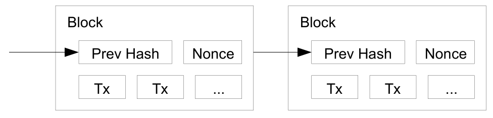

---?image=pitch/images/blockchain.jpg&size=cover

<h1 style="color: white;">Blockchain</h1>
<h3 style="color: white;">Background, Basics, and Beyond</h3>

---

## *So Hot Right Now*


---

# Blockchain Background

+++?image=pitch/images/networktypes.png&size=contain

<h1 style="text-shadow:	-3px -3px 0 #FFF, 3px -3px 0 #FFF, -3px 3px 0 #FFF, 		3px 3px 0 #FFF;">Types of Networks</h1>

+++?image=pitch/images/centralized.png&size=contain

<h1 style="text-shadow:	-3px -3px 0 #FFF, 3px -3px 0 #FFF, -3px 3px 0 #FFF, 		3px 3px 0 #FFF;">Centralized</h1>

1. Single node (single point of failure)
1. Controlled by a single entity

+++

### Examples:
* Many Internet services
* Websites (some)
* Bulletin Board Systems (BBS)
* File Servers

+++?image=pitch/images/decentralized.png&size=contain

<h1 style="text-shadow:	-3px -3px 0 #FFF, 3px -3px 0 #FFF, -3px 3px 0 #FFF, 		3px 3px 0 #FFF;">Decentralized</h1>

1. Multiple nodes
1. Controlled by the same entity

+++

### Examples:
* Most Internet services
* Websites (modern)
* Content Delivery Networks (CDN)
* Load Balancers
* DNS

+++?image=pitch/images/distributed.png&size=contain

<h1 style="text-shadow:	-3px -3px 0 #FFF, 3px -3px 0 #FFF, -3px 3px 0 #FFF, 		3px 3px 0 #FFF;">Distributed</h1>

1. Many discrete nodes
1. Control of any arbitrary entity

+++

### Examples
* The Internet
* Email
* Bittorrent
* TOR
* Correspondence Chess??

---

# Let's Play Chess


+++

**Alice** and **Eve** play Correspondence Chess
* Alice: `1 e4` 
* Eve replies `1 e5`
* Alice replies `2 Nf3`
* ...

+++

# Distributed Ledger
* Alice: `1 e4`
* Eve replies `1 e5`
* Alice replies `2 Nf3`
* ...

#### _Distributed Ledger = Blockchain_

---

# Blockchain Beginnings

+++

# 1991
## Haber and Stornetta


_How to Time-Stamp a Digital Document_

+++

# 2008
## Satoshi Nakamoti


_Bitcoin paper_

**Solves the double-spend problem**

---

# Crypto Review

+++

# Hashing

```{sh}
$ echo 'blockchain' | sha256sum
5318d781b12ce55a4a21737bc6c7906db0717d0302e654670d54fe048c82b041
$ echo 'Blockchain' | sha256sum
fe7d0290395212c39e78ea24ba718911af16effa13b48d1f6c9d86e8355e0770
```

+++

# Public Key Cryptography

+++?image=pitch/images/publickey.png&size=contain

---


- Transactions |
- Proof of Work |

+++

# Transactions

+++?image=pitch/images/bitcoin_transactions.png&size=contain

+++

# Proof of Work


+++


Goal: Block hash below threshold

Nonce
- 0001 |
- 0002 |
- 0003 |
- etc |

---

# Bitcoin Evolution

Growth

- 100GB+ |
- 1092 'Altcoins' |

+++


- Proof of Work |
- Smart Contracts |
- Ethereum Virtual Machine (Ethereum World Computer) |

---

# Blockchain Future

+++

# Permissionless or Permissioned?

+++

**Permissionless (Public):**

* Publicly readable (& verifiable)
* Publicly writable
* *Bitcoin*
* *Ethereum*

+++

**Permissioned (Private):**

* Publicly or privately readable
* Privately writable
* *Sovrin*

---

# Applications

+++

# Chain of Custody
- Manufacturing - (RF DNA) |
- Evidence |

+++

# Off-Ledger Integration

Case Study: **Real Estate**

+++


- 2015 Linux Foundation |
- Many different blockchains and tools |

+++

# Hyperledger Indy


---

# Privledge
## _Private Permissioned Ledger_
- Python 3.5 |
- MIT License |
- github.com/elBradford/privledge |

+++

# Demo


