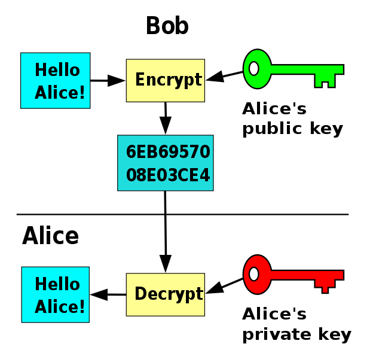
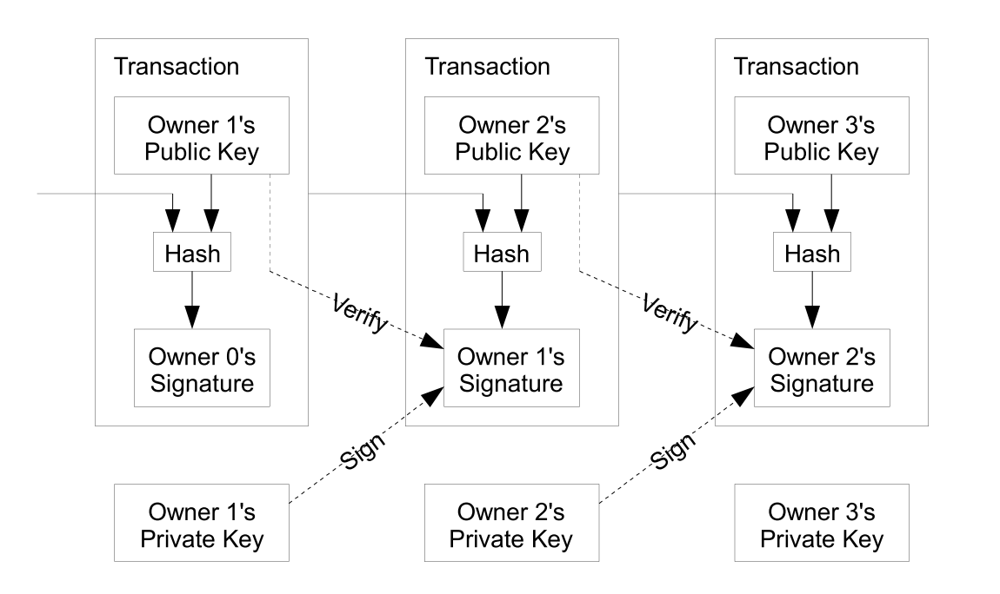
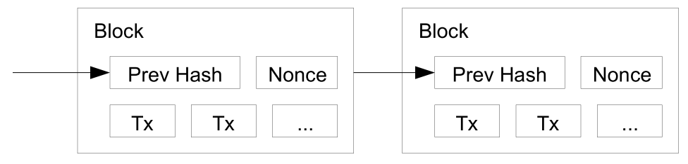

# Blockchain

---?image=/assets/md/assets/blockchain.jpg&size=cover

## *So Hot Right Now*


---

# Bradford Law

- BYU BS in EE
- Undergraduate Cyber Training
- Intermediate Network Warfare Training
- Scott AFB (Scope Edge, CPT)
- Air Force Institute of Technology: MS Cyber Operations

---

# Blockchain Background

+++

# Types of Networks


+++


# Centralized
1. Single node (single point of failure)
1. Controlled by a single entity

+++

### Examples:
* Many Internet services
* Websites (some)
* Bulletin Board Systems (BBS)
* File Servers

+++


# Decentralized
1. Multiple nodes
1. Controlled by the same entity

+++

### Examples:
* Most Internet services
* Websites (modern)
* Content Delivery Networks (CDN)
* Load Balancers
* DNS

+++


# Distributed
1. Many discrete nodes
1. Control of any arbitrary entity

+++

### Examples
* The Internet
* Email
* Bittorrent
* TOR
* Correspondence Chess?? |

---

# Let's Play Chess


+++

**Alice** and **Eve** play Correspondence Chess
* Alice: `1 e4` |
* Eve replies `1 e5` |
* Alice replies `2 Nf3` |
* ... |

+++

# Distributed Ledger
* Alice: `1 e4`
* Eve replies `1 e5`
* Alice replies `2 Nf3`
* ...

## Distributed Ledger = Blockchain |

---

# Blockchain Beginnings
- 1991: Haber and Stornetta
    - 
- 2008: Satoshi Nakamoti |

+++

# 1991: Haber and Stornetta

_How to Time-Stamp a Digital Document_

+++

# 2008: Satoshi Nakamoti

_Bitcoin paper_
Solving the double-spend problem...

---

# Crypto Review

+++

# Hashing
```{sh}
$ echo 'blockchain' | sha256sum
5318d781b12ce55a4a21737bc6c7906db0717d0302e654670d54fe048c82b041
$ echo 'Blockchain' | sha256sum
fe7d0290395212c39e78ea24ba718911af16effa13b48d1f6c9d86e8355e0770
```

+++

# Public Key Cryptography


---


- Transactions |
- Proof of Work |

+++

# Transactions


+++

# Proof of Work


---

# Bitcoin Evolution
Growth:
- 100GB+
- 1092 ['Altcoins'](https://coinmarketcap.com/all/views/all/)

+++


- Smart Contracts |
- Ethereum World Computer |
- (Ethereum Virtual Machine) |

+++

# Proof of Stake

---

# Permissioned Ledgers
**Permissionless (Public):**
* Publicly readable (& verifiable)
* Publicly writable

**Permissioned (Private):**
* Publicly or privately readable
* Privately writable

---

# Blockchain Future

+++

# Chain of Custody

+++

# Off-Ledger Integration

+++

# Insurance


+++

# Real Estate

+++

# Government
## Separate Ledgers

+++


- 2015 Linux Foundation |
- Many different blockchains and tools |
 |

---

# Privledge
## _Private Permissioned Ledger_ |
- Python 3.5 |
- MIT License |
- https://github.com/elBradford/privledge |

+++

# Demo


# Types of Networks

Let's go over a bit of background first - trust me, it will help out later on. Networks fall roughly in three categories:

* Centralized
* Decentralized
* Distributed


*Figure 1 - Network Types (Image credit: Wikipedia)*

It's important to understand that we're not only talking about computer networks, although they make up nearly the entirety of what I talk about in this article. This taxonomy of networks applies to all networks, such as social, commercial, and political. I'll try to include non-computer network examples below.


## Centralized

Figure 1-A: Although not a good candidate for blockchain protocols, let's understand what a centralized network is to provide some context for the other two network types. Centralized networks have <a target="_blank" href="https://gnunet.org/centralized-dns">two primary characteristics</a>:
1. They consist of a single node (single point of failure)
1. This node is under the control of a single entity


### Examples:
* Many Internet services
* Websites (some)
* Bulletin Board Systems (BBS)
* File Servers
* Central Banks
* Autocracy (Single governing head with absolute power)


### Advantages:
* Centralized Control 
* Single component to maintain


### Disadvantages:
* Vulnerable to
    * Attack (DDoS, etc)
    * Traffic Spikes


## Decentralized

Figure 1-B: It is possible for blockchain protocols to support decentralized networks, at least in part (as validators), however this is not typical. Decentralized networks have two primary characteristics:
1. They consist of multiple nodes
1. Each node is under the control of the same entity


### Examples:
* Most Internet services
* Websites
* Content Delivery Networks (CDN)
* Load Balancers
* DNS
* Oligarchy
* Representative Government (eg Republic)


### Advantages
* Resiliency
* Control of the network


### Disadvantages
* Overhead of
    * Managing assets
    * Managing distribution
    * Synchronization
    * Maintenance


## Distributed

Figure 1-C: Blockchains are considered a distributed ledger or distributed database. A blockchain protocol (wholly or in part) comprises a distributed network. Distributed networks have two primary characteristics:
1. They consist of many discrete nodes
1. Each node may be under the control of any arbitrary entity

### Examples
* The Internet
* Email
* Bittorrent
* Blockchain
* TOR
* Democracy (consensus is determined by majority of individuals)
* Anarchy*
* Correspondence Chess?? 

### Advantages
* Very resistent to censorship
* Trustless

### Disadvantages
* Trustless
* Difficult to control

\*<sub>Anarchy consists of individuals with complete individual sovereignty - governments unto themselves. In this way anarchy may be considered a completely distributed form of government.</sub>


# How do you trust others in a trustless system?
This important and difficult question didn't have a good answer for many years. Confidence and trust are mutually necessary for most systems, however they are very difficult to accomplish in a distributed network.

Consider an Analogy:


## Correspondence Chess

<sub>I'm borrowing this analogy from National Institute of Standards and Technology (NIST)'s John Kelsey's 2016 <a target="_blank" href="/assets/bin/2017/Introduction_to_Blockchain_-_John_Kelsey.pdf">_Introduction to Blockchains_</a></sub>

Correspondence Chess or Chess by Mail was a very popular pre-Internet method of multiplayer 'online' gaming. <a target="_blank" href="https://en.wikipedia.org/wiki/Correspondence_chess">It's played still</a>, though its popularity has waned. 

Alice and Eve want to play Correspondence Chess. Alice makes the first move:
* Alice: `1 e4`
* Eve replies `1 e5`
* Alice replies `2 Nf3`
* ...


## Chess Board State

Correspondence Chess is an example of a distributed network, albeit with only two nodes. Each party has a copy of the board at home, and each has independent and total control of their own board. For the game to be playable, each has to agree on the state of the game.

If Eve attempts to cheat, will Alice know? How?

The game is composed of the following parts:
1. The starting positions of the board (immutable)
1. The sequence of messages (one for each move)

The state of the game at time `t` is represented by every message, in order, up until time `t`. In other words, __If we agree on the history of moves, we agree on the present state of the game.__ That history is represented by what is called a _distributed ledger_.

## Distributed Ledgers

I have been primarily using the word blockchain, however now that we understand what a distributed ledger represents, I will use that term as well. For the purposes of this article they are synonymous.

Just as the Correspondence Chess game allows mutually-distrusting players to agree on the state of the game, a distributed ledger allows mutually-distrusting users to agree on the state of the distributed system. That's how a distributed ledger (such as blockchain) inspires confidence among untrusting and anonymous nodes.

Continue on to the meat of the series, <a target="_blank" href="{{page.next.url}}">{{page.next.title}}</a>