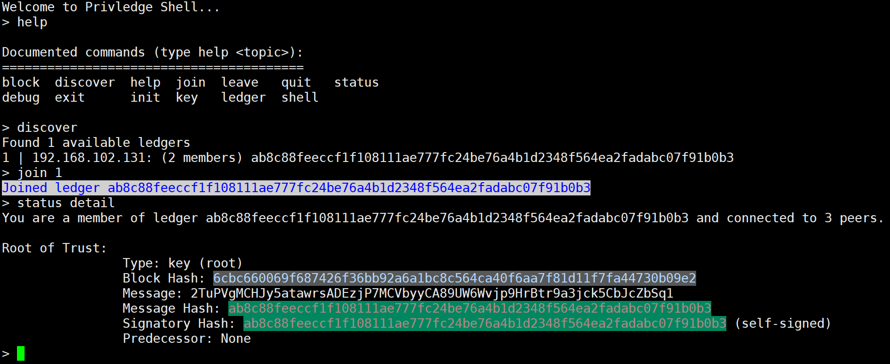
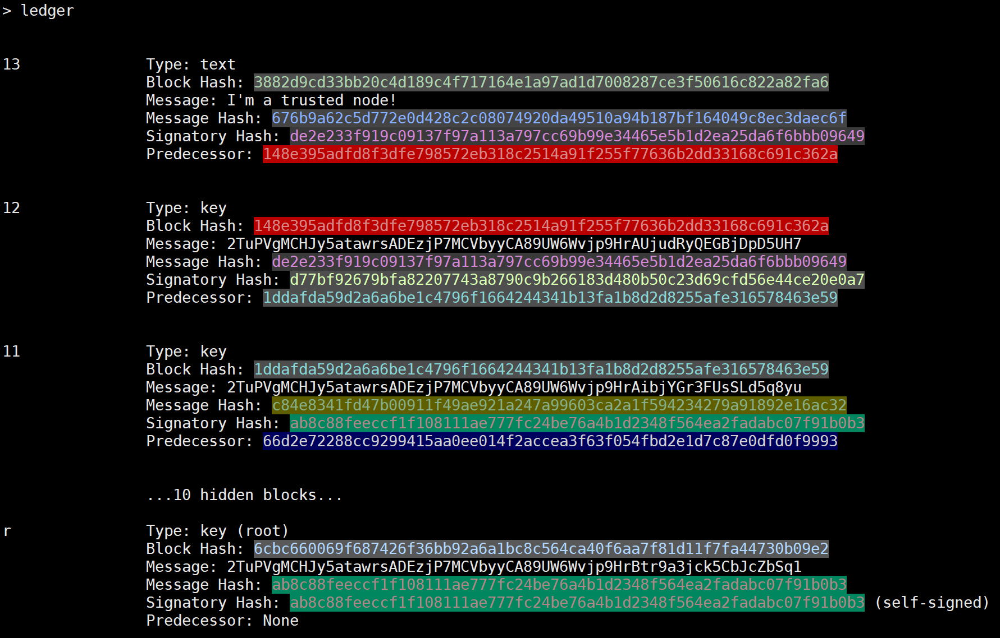

Privledge
======
**Privledge** is a proof of concept private permissioned distributed ledger for public key management written in Python 3.5.



---

## Download
### [Current Master (zip)](https://github.com/elBradford/privledge/archive/master.zip)

### Github 

```
$ git clone https://github.com/elBradford/privledge.git
```

---

## [Install](INSTALL.md)

## [Usage](USAGE.md)

## Other Resources
4-part Blockchain overview
- [Part 0: Blockchain Background Reading](https://bradford.la/2017/blockchain-0)
- [Part 1: Blockchain Origin Story](https://bradford.la/2017/blockchain-1)
- [Part 2: Blockchain Present and Beyond](https://bradford.la/2017/blockchain-2)
- [Part 3: Privledge](https://bradford.la/2017/blockchain-3)
- [](https://gitpitch.com/elBradford/privledge/master?grs=github&t=white)

---
## Credits
- [Bradford Law](https://bradford.la) 
- [Air Force Institute of Technology](https://www.afit.edu)

## [License: MIT](LICENSE.txt)



<<<<<<< HEAD
=======
[](https://gitpitch.com/elBradford/privledge/master?grs=github&t=white)
>>>>>>> 4c6447a321720427a60f0ef077fc4c730191f237
