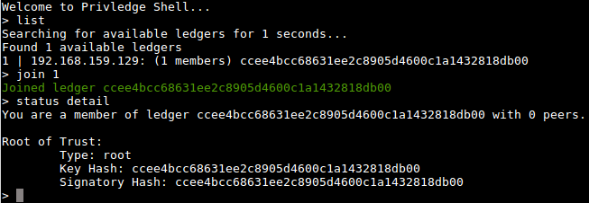

Privledge
======
**Privledge** is a proof-of-concept private, privileged ledger used for public key management written in python.

#### Screenshot


## Download
#### [Current Master (zip)](https://github.com/elBradford/privledge/archive/master.zip)

#### Github 
```
$ git clone https://github.com/elBradford/privledge.git
```

## [License: MIT](LICENSE.txt)


## [Tutorial](TUTORIAL.md)